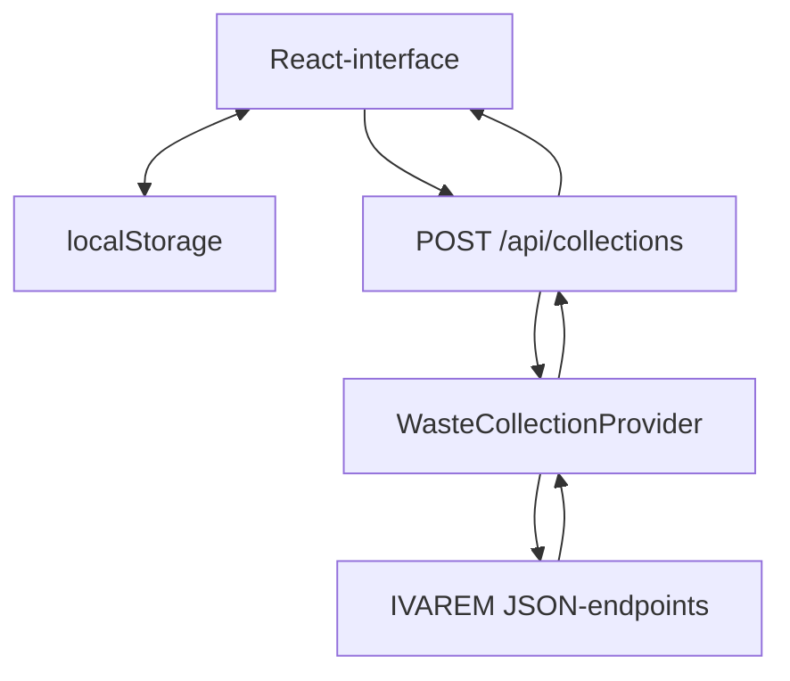

# Afval Kalender — technische documentatie

Deze documentatie beschrijft de architectuur, werking en projectstructuur van
**Afval Kalender**. De applicatie toont welke afvalsoorten morgen en tijdens de
komende zeven dagen door IVAREM worden opgehaald.

Publieke versie:
[afval-kalender.stuie-vm.chatgpt.site](https://afval-kalender.stuie-vm.chatgpt.site)

## Inhoud

1. [Overzicht](#1-overzicht)
2. [Technologieën](#2-technologieën)
3. [Architectuur](#3-architectuur)
4. [Projectstructuur](#4-projectstructuur)
5. [Opstarten van de applicatie](#5-opstarten-van-de-applicatie)
6. [Adresinstellingen](#6-adresinstellingen)
7. [Cache en vernieuwen](#7-cache-en-vernieuwen)
8. [Communicatie met IVAREM](#8-communicatie-met-ivarem)
9. [Interne datamodellen](#9-interne-datamodellen)
10. [React-interface](#10-react-interface)
11. [Datum- en tijdslogica](#11-datum--en-tijdslogica)
12. [Afvalcategorieën, iconen en kleuren](#12-afvalcategorieën-iconen-en-kleuren)
13. [Styling en responsive ontwerp](#13-styling-en-responsive-ontwerp)
14. [Foutafhandeling](#14-foutafhandeling)
15. [Privacy en lokale opslag](#15-privacy-en-lokale-opslag)
16. [Lokaal ontwikkelen](#16-lokaal-ontwikkelen)
17. [Build en hosting](#17-build-en-hosting)
18. [Veelvoorkomende aanpassingen](#18-veelvoorkomende-aanpassingen)
19. [Mogelijke toekomstige verbeteringen](#19-mogelijke-toekomstige-verbeteringen)

## 1. Overzicht

Afval Kalender is een kleine full-stack webapplicatie:

- De interface is gebouwd met React en TypeScript.
- Next.js levert de structuur voor pagina's, layouts en API-routes.
- Een eigen serverroute communiceert met de IVAREM-databron.
- Het gekozen adres en een tijdelijke kalendercache worden in de browser
  bewaard.
- De applicatie gebruikt de tijdzone `Europe/Brussels`.
- De productieversie draait als een Cloudflare Worker.

De browser communiceert niet rechtstreeks met IVAREM. De interne API-route
vormt een gecontroleerde tussenlaag en zet het antwoord van IVAREM om naar een
eenvoudig, stabiel datamodel.

## 2. Technologieën

| Technologie | Functie |
|---|---|
| TypeScript | JavaScript met compile-time typecontrole |
| React 19 | Componenten, state en automatisch vernieuwen van de interface |
| Next.js App Router | Pagina's, layouts en interne API-routes |
| Vite en Vinext | Lokale ontwikkelserver en build van de Next.js-structuur |
| Cloudflare Worker | Serverruntime van de gepubliceerde applicatie |
| CSS | Vormgeving, kleuren en responsive layout |
| `localStorage` | Lokale opslag van het adres en kalendergegevens |
| Google Material Symbols | Pictogrammen voor afvalsoorten en acties |
| Node Test Runner | Unit tests voor datumlogica en afvalnormalisatie |

De broncode gebruikt een Next.js-achtige structuur. Voor de gepubliceerde
Sites-versie vertaalt Vinext deze structuur via Vite naar een Cloudflare Worker.

## 3. Architectuur



De verantwoordelijkheden zijn bewust gescheiden:

1. **React-interface**  
   Toont het formulier, de kaart voor morgen, het weekoverzicht en fouten.

2. **Adresinstellingen**  
   Leest, bewaart en verwijdert het gekozen adres.

3. **Kalendercache**  
   Vermijdt onnodige netwerkrequests en biedt een terugval bij storingen.

4. **API-route**  
   Valideert requests en schermt de browser af van de IVAREM-implementatie.

5. **IVAREM-provider**  
   Vertaalt postcode, straat en huisnummer naar de benodigde IVAREM-ID's en
   haalt vervolgens de kalender op.

6. **Normalisatie**  
   Zet externe afvalbenamingen om naar consistente categorieën, iconen en
   kleuren.

## 4. Projectstructuur

```text
Afval-Kalender/
├── app/
│   ├── api/
│   │   └── collections/
│   │       └── route.ts
│   ├── globals.css
│   ├── layout.tsx
│   └── page.tsx
├── lib/
│   ├── dates.ts
│   ├── mock-data.ts
│   ├── types.ts
│   └── waste-normalization.ts
├── services/
│   ├── address-settings.ts
│   ├── collection-cache.ts
│   └── ivarem-provider.ts
├── tests/
├── docs/
├── public/
├── worker/
│   └── index.ts
├── build/
└── package.json
```

### `app/`

Bevat de pagina, algemene layout, styling en interne serverroute.

- `app/page.tsx`: hoofdinterface en gebruikersinteracties.
- `app/layout.tsx`: HTML-layout, metadata, lettertypes, Material Symbols en
  globale CSS.
- `app/globals.css`: kleuren, afmetingen, kaarten en responsive regels.
- `app/api/collections/route.ts`: interne API-route voor kalenderrequests.

### `services/`

Bevat services die technische details afschermen van de interface.

- `services/address-settings.ts`: beheer van het opgeslagen adres.
- `services/collection-cache.ts`: beheer van de zesuurcache.
- `services/ivarem-provider.ts`: communicatie met IVAREM.

### `lib/`

Bevat gedeelde modellen en logica.

- `lib/types.ts`: TypeScript-datamodellen.
- `lib/dates.ts`: datum- en tijdzonefuncties.
- `lib/waste-normalization.ts`: afvalcategorieën, iconen en kleuren.
- `lib/mock-data.ts`: voorbeeldgegevens voor ontwikkeling en demonstratie.

### `tests/`

Bevat unit tests voor onderdelen die zonder browser getest kunnen worden,
waaronder datumlogica en afvalnormalisatie.

### `worker/`

Bevat de ingang van de productieruntime. De Worker ontvangt requests en stuurt
ze door naar de gegenereerde applicatiehandler.

## 5. Opstarten van de applicatie

`app/page.tsx` begint met:

```tsx
"use client";
```

Dit maakt de pagina een React Client Component. De code mag daardoor
browserfunctionaliteit gebruiken, zoals:

- `localStorage`;
- `useState`;
- `useEffect`;
- klikhandlers;
- `fetch`.

De belangrijkste schermstatus is:

```tsx
type ViewState = "loading" | "settings" | "ready" | "error";
```

| Status | Zichtbaar resultaat |
|---|---|
| `loading` | Laadindicator |
| `settings` | Adresformulier |
| `ready` | Kalender voor morgen en de komende dagen |
| `error` | Foutmelding met herstelacties |

Bij de eerste render controleert React of er al een adres bestaat:

```tsx
useEffect(() => {
  const savedAddress = addressSettingsService.getAddress();

  if (!savedAddress) {
    setState("settings");
    return;
  }

  setAddress(savedAddress);
  void load(savedAddress);
}, [load]);
```

De opstartvolgorde is:

1. Lees het adres uit `localStorage`.
2. Toon het adresformulier als er geen adres bestaat.
3. Controleer de kalendercache als er wel een adres bestaat.
4. Gebruik een geldige cache of vraag nieuwe gegevens op.
5. Toon de kalender of een herstelbare foutmelding.

## 6. Adresinstellingen

Een adres bestaat minimaal uit:

```ts
interface Address {
  postalCode: string;
  street: string;
  houseNumber: string;
}
```

De adresservice biedt een kleine, vervangbare interface:

```text
AddressSettingsService
    getAddress()
    saveAddress(address)
    clearAddress()
```

Deze abstractie voorkomt dat `page.tsx` rechtstreeks afhankelijk is van
`localStorage`. Later kan dezelfde interface bijvoorbeeld worden gekoppeld aan:

- een gebruikersaccount;
- server-side opslag;
- synchronisatie tussen apparaten;
- een mobiele app.

Een nieuw adres wordt pas opgeslagen nadat de gegevens succesvol door de
serverroute en de IVAREM-provider zijn verwerkt. Zo wordt een ongeldig of niet
gevonden adres niet als geldige voorkeur bewaard.

## 7. Cache en vernieuwen

Voor ieder adres bewaart de applicatie tijdelijk de laatst opgehaalde
kalendergegevens.

Vereenvoudigd cachemodel:

```json
{
  "addressKey": "2800|voorbeeldstraat|10",
  "savedAt": 1785182400000,
  "data": {
    "address": {
      "postalCode": "2800",
      "street": "Voorbeeldstraat",
      "houseNumber": "10"
    },
    "collections": [],
    "lastUpdated": "2026-07-27T20:00:00+02:00"
  }
}
```

De normale laadlogica controleert eerst de cache:

```tsx
const cached = cacheService.get(savedAddress);

if (!force && cached && !cached.expired) {
  setData(cached.data);
  setState("ready");
  return;
}
```

Gedrag:

- Een cache jonger dan zes uur wordt onmiddellijk gebruikt.
- Na zes uur probeert de app nieuwe gegevens op te halen.
- Bij succes wordt de cache vervangen.
- Bij een tijdelijke netwerk- of IVAREM-fout mag een verlopen cache als
  terugval worden getoond.
- De interface vermeldt wanneer de gegevens voor het laatst zijn bijgewerkt.
- De knop **Vernieuwen** gebruikt `force = true` en slaat de geldige
  cachecontrole over.

## 8. Communicatie met IVAREM

### 8.1 Request vanuit de browser

De React-interface verstuurt een request naar de eigen applicatie:

```http
POST /api/collections
Content-Type: application/json
```

Voorbeeld:

```json
{
  "address": {
    "postalCode": "2800",
    "street": "Voorbeeldstraat",
    "houseNumber": "10"
  },
  "startDate": "2026-07-28",
  "endDate": "2026-08-10"
}
```

### 8.2 Validatie in de API-route

`app/api/collections/route.ts` controleert eerst of:

- een adres aanwezig is;
- postcode, straat en huisnummer strings zijn;
- begin- en einddatum aanwezig en bruikbaar zijn;
- de request de verwachte structuur heeft.

Daarna roept de route de provider aan:

```ts
const result = await provider.getCollections(
  body.address,
  body.startDate,
  body.endDate
);
```

### 8.3 Providerstappen

De IVAREM-provider voert conceptueel drie requests uit:

1. Zoek de gemeente op basis van de postcode.
2. Zoek de straat binnen die gemeente.
3. Vraag ophaaldata op met gemeente-ID, straat-ID en huisnummer.

Een vereenvoudigd IVAREM-item kan er als volgt uitzien:

```json
{
  "ophaaldatum": "2026-07-28T00:00:00",
  "fractieCode": "PMD",
  "fractie": "PMD",
  "kleurcode": "#2186C4"
}
```

De provider groepeert items per dag en zet ze om naar het eigen model:

```json
{
  "date": "2026-07-28",
  "wasteTypes": [
    {
      "code": "PMD",
      "name": "PMD",
      "sourceColor": "#2186C4"
    }
  ]
}
```

### 8.4 Waarom een eigen API-route?

De tussenlaag biedt meerdere voordelen:

- Browser-CORS vormt geen blokkering.
- De interface kent geen interne IVAREM-ID's.
- Inputvalidatie gebeurt op één plaats.
- Technische fouten worden vertaald naar bruikbare meldingen.
- Wijzigingen aan IVAREM hebben minder directe invloed op React.
- Een andere gegevensbron kan later dezelfde interface implementeren.

De providerinterface is conceptueel:

```ts
export interface WasteCollectionProvider {
  getCollections(
    address: Address,
    startDate: string,
    endDate: string
  ): Promise<CollectionResponse>;
}
```

Vergelijkbaar in C#:

```csharp
public interface IWasteCollectionProvider
{
    Task<CollectionResponse> GetCollectionsAsync(
        Address address,
        DateOnly startDate,
        DateOnly endDate);
}
```

> Let op: de gebruikte IVAREM-JSON-endpoints zijn publiek bereikbaar, maar
> hebben geen gedocumenteerd versiecontract. De provider moet daarom als een
> vervangbaar integratieonderdeel worden behandeld. De applicatie gebruikt geen
> login, afgeschermde gegevens of HTML-scraping.

## 9. Interne datamodellen

Het centrale antwoordmodel ziet er conceptueel als volgt uit:

```ts
interface CollectionResponse {
  address: Address;
  collections: CollectionDay[];
  lastUpdated: string;
}

interface CollectionDay {
  date: string;
  wasteTypes: WasteType[];
}

interface WasteType {
  code: string;
  name: string;
  sourceColor?: string;
}
```

Voorbeeld:

```json
{
  "address": {
    "postalCode": "2800",
    "street": "Voorbeeldstraat",
    "houseNumber": "10"
  },
  "collections": [
    {
      "date": "2026-07-28",
      "wasteTypes": [
        {
          "code": "PMD",
          "name": "PMD",
          "sourceColor": "#2186C4"
        }
      ]
    }
  ],
  "lastUpdated": "2026-07-27T20:00:00+02:00"
}
```

Dit model vormt een contract tussen server en interface. React hoeft de
oorspronkelijke IVAREM-veldnamen niet te kennen.

## 10. React-interface

### 10.1 State

De hoofdcomponent beheert onder andere:

```tsx
const [address, setAddress] = useState<Address | null>(null);
const [data, setData] = useState<CollectionResponse | null>(null);
const [error, setError] = useState("");
```

Wanneer een `set...`-functie wordt aangeroepen, rendert React automatisch de
onderdelen die van die state afhankelijk zijn.

Conceptueel:

```text
UI = render(state)
```

Voor een Unity-ontwikkelaar: een React-component lijkt minder op een
`MonoBehaviour` en meer op een functie die beschrijft hoe de interface er voor
de huidige gegevens moet uitzien.

### 10.2 Hoofdcomponent

De hoofdcomponent regelt:

- initiële adrescontrole;
- laden vanuit cache of API;
- openen en sluiten van instellingen;
- vernieuwen;
- voorbeelddata;
- foutstatussen;
- doorgeven van data aan presentatiecomponenten.

### 10.3 Adresformulier

Het adresformulier:

- verzamelt postcode, straat en huisnummer;
- voorkomt een request met lege velden;
- toont een laadstatus tijdens controle;
- slaat het adres pas op na een succesvolle kalenderrequest;
- laat de gebruiker later het adres wijzigen of vergeten.

### 10.4 Afvallijst

Een afvallijst ondersteunt nul, één of meerdere ophalingen:

```tsx
function WasteList({ wasteTypes }: { wasteTypes: WasteType[] }) {
  if (!wasteTypes.length) {
    return <span>Geen ophaling</span>;
  }

  return wasteTypes.map(/* categorie weergeven */);
}
```

### 10.5 Afvalicoon

Voor iedere afvalsoort vraagt de interface een presentatieconfiguratie op:

```tsx
const presentation = getWastePresentation(waste);
```

Die bevat onder andere:

- de Material Symbol-naam;
- een kleur;
- een interne categorie;
- een bruikbaar tekstlabel.

De zichtbare naam blijft altijd aanwezig. De betekenis wordt dus nooit alleen
via kleur of een icoon gecommuniceerd.

## 11. Datum- en tijdslogica

De applicatie bepaalt de lokale datum expliciet in:

```text
Europe/Brussels
```

Een datumformatter kan bijvoorbeeld als volgt worden opgebouwd:

```ts
new Intl.DateTimeFormat("en-CA", {
  timeZone: "Europe/Brussels",
  year: "numeric",
  month: "2-digit",
  day: "2-digit"
});
```

Intern gebruikt de applicatie kalenderdatums in het formaat:

```text
YYYY-MM-DD
```

Dat voorkomt ongewenste datumverschuivingen door UTC-conversies. Voor de
gebruiker worden ze in het Nederlands weergegeven, bijvoorbeeld:

```text
dinsdag 28 juli
```

De app vraagt veertien dagen op maar toont zeven dagen. De extra dagen maken
het mogelijk de eerstvolgende ophaling te vinden wanneer er morgen geen
ophaling is.

De expliciete tijdzone houdt rekening met:

- zomer- en winteruur;
- requests rond UTC-middernacht;
- maand- en jaarovergangen;
- verschillende tijdzones van browser en server.

## 12. Afvalcategorieën, iconen en kleuren

IVAREM-benamingen worden met herkenningsregels genormaliseerd:

```ts
{
  matches: /\b(gft|groente|fruit|tuinafval)\b/i,
  value: {
    key: "gft",
    icon: "compost",
    color: "#16806a"
  }
}
```

De normalisatie zoekt zowel in de externe code als in de naam:

```ts
categories.find(category =>
  category.matches.test(`${waste.code} ${waste.name}`)
);
```

De huidige kleurprioriteit is:

1. kleur geleverd door IVAREM;
2. ingestelde kleur voor de herkende categorie;
3. neutrale standaardkleur.

Bijvoorbeeld:

```ts
const color =
  waste.sourceColor ||
  category?.value.color ||
  "#6c7480";
```

Voorbeelden van Material Symbols:

| Afvalsoort | Material Symbol |
|---|---|
| PMD | `recycling` |
| Restafval | `delete` |
| GFT | `compost` |
| Papier en karton | `newspaper` |
| Onbekende categorie | `category` |

Onbekende categorieën blijven zichtbaar met:

- de originele IVAREM-benaming;
- een neutrale kleur;
- het algemene `category`-icoon.

## 13. Styling en responsive ontwerp

De algemene kleuren staan als CSS-variabelen bovenaan in
`app/globals.css`. Er zijn twee lagen: neutrale tokens die per thema wisselen,
en een accentkleur die de gebruiker zelf kiest.

```css
:root {
  --ink: #17352e;
  --muted: #61746f;
  --bg: #f5f7f2;
  --surface: #fff;
  --line: #dfe7e2;
  --danger: #a53b35;
  --on-accent: #fff;
}

:root[data-theme="dark"] {
  --ink: #e7ecee;
  --bg: #14181a;
  --surface: #1d2225;
  --on-accent: #0e1614;
}
```

De accentkleur volgt uit `data-accent` op `<html>`; per accent bestaat er een
lichte en een donkere variant, zodat de kleur in beide thema's leesbaar blijft:

```css
:root[data-accent="blue"] { --accent: var(--c-blue); --accent-strong: var(--c-blue-2); }
:root[data-theme="dark"][data-accent="blue"] { --accent: var(--c-blue-d); --accent-strong: var(--c-blue-d2); }
```

Door CSS-variabelen te gebruiken, kan het algemene kleurthema op één plaats
worden aangepast. Zie hoofdstuk 13a voor de thema-instellingen zelf.

### 13a. Thema en accentkleur

- `lib/theme.ts` bevat de lijst met accenten, de opslagsleutels en het
  `themeBootstrapScript`.
- `services/theme-settings.ts` leest en schrijft de voorkeuren in
  `localStorage` (`afvalmorgen.theme.v1` en `afvalmorgen.accent.v1`) en waarschuwt
  abonnees, ook bij een wijziging in een ander tabblad.
- `app/layout.tsx` voert het bootstrap-script uit in `<head>`, zodat `data-theme`
  en `data-accent` al vóór de eerste weergave juist staan en de pagina niet
  kortstondig in het verkeerde thema flitst.
- `useAppearance` in `app/page.tsx` houdt `<html>` daarna in sync en volgt de
  systeemvoorkeur wanneer de modus op `system` staat.

Ongeldige of onbekende opgeslagen waarden worden genegeerd; dan gelden de
standaarden (`system` en het groene accent).

Het weekoverzicht gebruikt CSS Grid:

```css
.days-grid {
  display: grid;
  grid-template-columns: repeat(7, minmax(0, 1fr));
}
```

Op smallere schermen verandert de indeling:

```css
@media (max-width: 900px) {
  .days-grid {
    grid-template-columns: repeat(2, 1fr);
  }
}

@media (max-width: 640px) {
  .days-grid {
    grid-template-columns: 1fr;
  }
}
```

| Scherm | Indeling |
|---|---|
| Desktop | Zeven kolommen |
| Tablet | Twee kolommen |
| Smartphone | Eén kolom |

Tailwind kan in de technische dependencies aanwezig zijn, maar de huidige
interface gebruikt hoofdzakelijk gewone CSS-klassen.

## 14. Foutafhandeling

De applicatie voorziet herkenbare situaties voor:

- ongeldig of onvolledig adres;
- adres niet gevonden;
- IVAREM tijdelijk onbereikbaar;
- netwerkfout;
- geen kalendergegevens;
- onverwachte response van IVAREM;
- onverwachte serverfout.

Een foutscherm moet altijd minstens één zinvolle vervolgactie aanbieden:

- opnieuw proberen;
- adres aanpassen;
- adres vergeten;
- verlopen cachegegevens gebruiken;
- voorbeelddata openen.

Technische details en interne foutreferenties worden niet rechtstreeks aan de
gebruiker getoond. De server mag intern meer informatie loggen, terwijl de
interface een korte en begrijpelijke melding ontvangt.

## 15. Privacy en lokale opslag

Er is geen gebruikersdatabase. Iedere bezoeker stelt zijn eigen adres in en de
browser bewaart het lokaal.

De gebruikte sleutels behouden de oude projectnaam om bestaande instellingen
na de naamswijziging niet te verliezen:

```text
afvalmorgen.address.v1
afvalmorgen.collections.v1
```

Eigenschappen van `localStorage`:

- gekoppeld aan één domein;
- gekoppeld aan één browserprofiel;
- niet automatisch gesynchroniseerd tussen apparaten;
- niet beschikbaar op een andere domeinnaam;
- niet bedoeld voor wachtwoorden of geheime tokens.

De serverroute bewaart het adres niet permanent. Het adres wordt alleen gebruikt
om de gevraagde IVAREM-kalender op te halen.

Omdat `localStorage` per domein werkt, moet een gebruiker het adres opnieuw
instellen wanneer de applicatie naar een andere URL verhuist.

## 16. Lokaal ontwikkelen

### Vereisten

- Node.js 22.13 of nieuwer;
- npm;
- een IDE zoals Visual Studio Code, WebStorm of Rider.

### Installeren

```bash
cd Afval-Kalender
npm ci
```

### Ontwikkelserver starten

```bash
npm run dev
```

Open daarna het lokale adres dat Vite in de terminal toont.

### Openen in Visual Studio Code

```bash
code .
```

### Tests uitvoeren

```bash
npm test
```

### Linting

```bash
npm run lint
```

### Productiebuild

```bash
npm run build
```

Een nuttige controle vóór publicatie is:

```bash
npm test
npm run lint
npm run build
```

## 17. Build en hosting

Tijdens lokaal ontwikkelen start `npm run dev` conceptueel:

1. Vite;
2. Vinext voor de Next.js-structuur;
3. een lokale omgeving voor de serverroutes en Worker.

Tijdens `npm run build`:

1. worden TypeScript- en React-modules gebundeld;
2. worden de Next.js-routes door Vinext vertaald;
3. wordt de API-route onderdeel van de Worker;
4. worden CSS, JavaScript, lettertypes en afbeeldingen gebundeld;
5. wordt de productie-uitvoer gegenereerd.

`worker/index.ts` ontvangt in productie de inkomende requests en geeft ze door
aan de gegenereerde applicatiehandler.

Het project kan ongebruikte database- of Drizzle-code bevatten vanuit het
hostingsjabloon. De huidige Afval Kalender gebruikt geen database.

## 18. Veelvoorkomende aanpassingen

### 18.1 Algemene kleuren veranderen

Pas de neutrale tokens in `app/globals.css` aan, voor elk thema apart:

```css
:root { --bg: #f4f7fb; --surface: #fff; }
:root[data-theme="dark"] { --bg: #14181a; --surface: #1d2225; }
```

### 18.1a Een accentkleur toevoegen

1. Voeg in `app/globals.css` de bronwaarden toe (licht, donker en het diepe
   paar voor de hero-kaart), bijvoorbeeld `--c-brick*`.
2. Voeg de vier regels toe die `--accent`, `--accent-strong`, `--hero-*` en
   `.accent-swatch[data-accent="brick"]` invullen.
3. Voeg het id toe aan `AccentId` in `lib/types.ts` en aan `ACCENTS` in
   `lib/theme.ts`, met een Nederlands label.

De keuzelijst in de instellingen en het bootstrap-script volgen automatisch.
`tests/unit/theme.test.ts` bewaakt dat beide lijsten gelijk blijven.

### 18.2 Teksten veranderen

Zoek de zichtbare tekst in `app/page.tsx`, bijvoorbeeld:

- `Morgen`;
- `Geen afvalophaling morgen`;
- `Zet dit afval vanavond buiten`;
- `Instellingen`;
- `Vernieuwen`.

### 18.3 Applicatienaam en metadata veranderen

Pas de metadata en algemene layout aan in `app/layout.tsx`.

Controleer ook zichtbare merktekst in `app/page.tsx`.

### 18.4 Een afvalicoon veranderen

Pas de categorie aan in `lib/waste-normalization.ts`:

```ts
{
  matches: /\bpmd\b/i,
  value: {
    key: "pmd",
    icon: "recycling",
    color: "#2186c4"
  }
}
```

Voor `icon` kan een naam uit
[Google Material Symbols](https://fonts.google.com/icons) worden gebruikt.

### 18.5 Altijd eigen kleuren gebruiken

De huidige logica geeft IVAREM-kleuren voorrang. Draai de volgorde om om eigen
categoriekleuren prioriteit te geven:

```ts
const color =
  category?.value.color ||
  waste.sourceColor ||
  "#6c7480";
```

### 18.6 Cacheduur veranderen

Pas de geldigheidsduur aan in `services/collection-cache.ts`. Gebruik bij
voorkeur een duidelijk benoemde constante:

```ts
const CACHE_DURATION_MS = 6 * 60 * 60 * 1000;
```

Voor twee uur:

```ts
const CACHE_DURATION_MS = 2 * 60 * 60 * 1000;
```

### 18.7 Meer of minder dagen tonen

De datumrange wordt berekend in de datumlogica en gebruikt bij het laden in
`app/page.tsx`. Houd rekening met twee afzonderlijke waarden:

- het aantal zichtbare dagen;
- het aantal opgehaalde dagen voor het zoeken naar de volgende ophaling.

### 18.8 IVAREM-integratie wijzigen

Technische wijzigingen aan requests, veldnamen of endpointparameters horen in:

```text
services/ivarem-provider.ts
```

Houd de `WasteCollectionProvider`-interface en het interne
`CollectionResponse`-model waar mogelijk ongewijzigd. Zo hoeft de interface
niet mee te veranderen.

## 19. Mogelijke toekomstige verbeteringen

Naarmate de applicatie groeit, kan `app/page.tsx` worden opgesplitst:

```text
components/
├── AddressForm.tsx
├── ErrorPanel.tsx
├── TomorrowCard.tsx
├── WasteIcon.tsx
└── WeekOverview.tsx

hooks/
└── useCollectionCalendar.ts

config/
└── waste-categories.ts
```

Voordelen:

- kleinere en beter leesbare bestanden;
- componenten kunnen afzonderlijk worden getest;
- UI-wijzigingen beïnvloeden minder snel de laadlogica;
- iconen en kleuren staan centraal in configuratie;
- andere databronnen kunnen gemakkelijker worden toegevoegd.

Andere mogelijke uitbreidingen:

- installeerbare Progressive Web App;
- browsernotificatie op de avond vóór een ophaling;
- meerdere opgeslagen adressen;
- ondersteuning voor andere afvalintercommunales;
- een beheerscherm voor kleuren, iconen en teksten;
- server-side caching om IVAREM verder te ontlasten;
- componenttests voor formulieren en foutstatussen;
- monitoring van wijzigingen in het IVAREM-responseformaat.

## Samenvatting

De belangrijkste gegevensstroom is:

```text
Gebruiker
  → React-interface
  → interne API-route
  → IVAREM-provider
  → IVAREM
  → genormaliseerd CollectionResponse
  → cache
  → kalenderinterface
```

De belangrijkste bestanden om als eerste te bestuderen zijn:

1. `app/page.tsx`
2. `services/ivarem-provider.ts`
3. `services/collection-cache.ts`
4. `lib/waste-normalization.ts`
5. `lib/dates.ts`
6. `app/globals.css`

